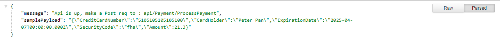

[](https://github.com/farQtech/filedPaymentAPi/actions/workflows/dotnet.yml)

# filedPaymentAPi

To test this project, clone into your local machine and run with visual studio or dotnet core cli.

once the project is up and running make you should see this on your browser



Once you see above screen you can make a post request to `https://localhost:44352/api/Payment/ProcessPayment` with payload similar to 

```
{
	"CreditCardNumber": "5105105105105100",
	"CardHolder": "Peter Pan",
	"ExpirationDate": "2025-04-07T00:00:00.000Z",
	"SecurityCode": "fha",
	"Amount": 21.3
}

```
# Sample Curl Request

```
curl -X POST \
  https://localhost:44352/api/Payment/ProcessPayment \
  -H 'cache-control: no-cache' \
  -H 'content-type: application/json' \
  -H 'postman-token: 8e2e06b2-fd72-a561-c166-a0a2ebe57e92' \
  -d '{
	"CreditCardNumber": "5105105105105100",
	"CardHolder": "Peter Pan",
	"ExpirationDate": "2025-04-07T00:00:00.000Z",
	"SecurityCode": "fha",
	"Amount": 21.3
}'

```
